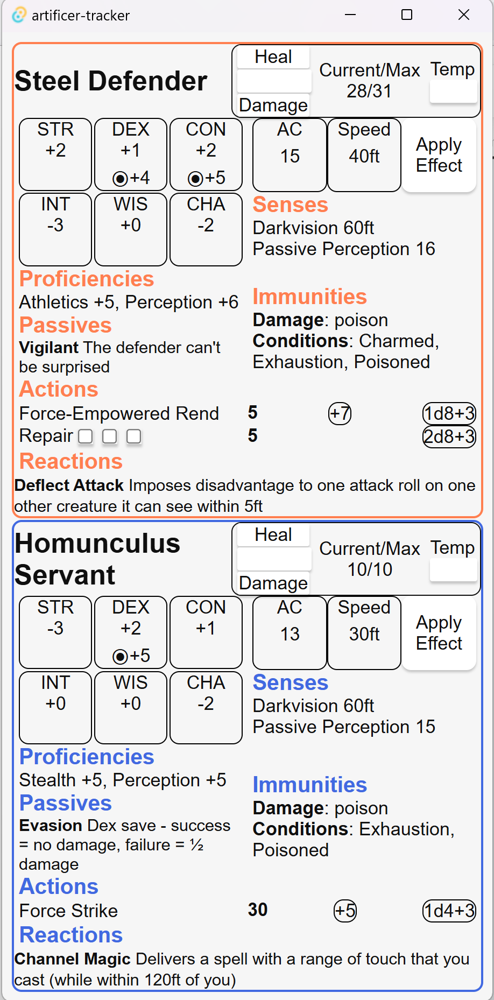

# Artificer Minions Tracker

A simple cross-platform app to track a Battle Smith's Steel Defender and Homunculus Servant

# Features
- Steel Defender and Homunculus Servant stat blocks that scale to your artificer level and intelligence modifiers
- Healing/Damage tracking, including temp HP
- Long rest button to reset everything
- Short rest button to reset some effects
- Hit dice management
- Bless and Enlarge effects automatically update the relevant actions
- Everything is saved between sessions, no need to worry!

# Installation
## Android
Download the APK in the latest release then run
`adb install <.apk location>` (requires adb).

# Usage
Most of the app is pretty straightforward, but here's a few tips:
- Use the "Apply Effect" panel to toggle bless or enlarge on your minion, or to manually spend hit dice
- Swipe right on the main screen (click & drag on PC) to open the short rest, long rest and settings menu
- Set your artificer level and int modifiers in the settings menu. The relevant features should update automatically